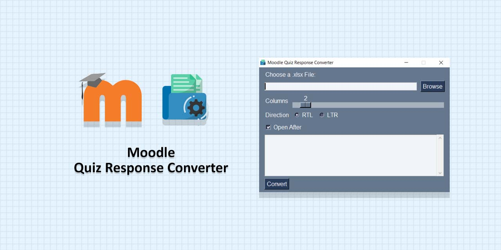

# Moodle Quiz Response Converter

Download the `.xlsx` file from the moodle quiz responses section, open it in the program and convert. It generates a `.docx` file that contains each user's response separated.

## Author

**Rabist** - view on [LinkedIn](https://www.linkedin.com/in/rabist)

## License

Licensed under [MIT](LICENSE).